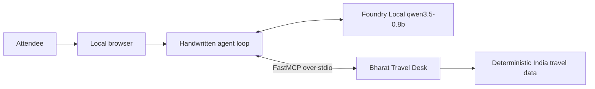

# Build MCP agents locally

A 90-minute, hands-on workshop for building with the Model Context Protocol
(MCP) on a prebuilt Windows VM. The lab uses Indian travel examples and runs
fully offline during the event.

The tested stack is:

- FastMCP `4.0.0`
- MCP protocol revision `2026-07-28`
- Foundry Local Python SDK `foundry-local-sdk-winml==1.2.4`
- Foundry Local model alias `qwen3.5-0.8b`
- Python 3.11 or newer on Windows

No cloud account, API key, package install, model download, or event Wi-Fi is
required. The facilitator prepares `.venv`, the Foundry Local runtime, and the
portable CPU model cache before distributing the VM image.

## Start here

Open PowerShell in the repository root on the workshop VM and run:

```powershell
.\workshop.ps1 check
```

The final line should be:

```text
All good - you are ready for the offline workshop.
```

If the script reports a failure, stop and ask the facilitator for a clean VM.
Attendees should not run `pip install`, download another model, or add cloud
credentials during the session.

Full setup guidance is in [docs/01-get-started.md](docs/01-get-started.md).

## The 90-minute route

| Stage | Lesson | Time |
|---|---|---:|
| 1 | [Check the offline VM](docs/01-get-started.md) | 5 min |
| 2 | [Understand MCP](docs/02-mcp-basics.md) | 10 min |
| 3 | [Build a FastMCP server](docs/03-build-a-server.md) | 20 min |
| 4 | [Run a client and agent loop](docs/04-raw-client.md) | 25 min |
| 5 | [Use the browser app](docs/05-browser.md) | 15 min |
| 6 | [Review production controls](docs/06-where-next.md) | 8 min |
| 7 | Knowledge check and close | 7 min |
| | **Total** | **90 min** |

The coding exercise creates one small server. The complete client, handwritten
agent loop, and browser app are supplied under `src/solution` so every attendee
can run the end-to-end experience within the session.

## What you build

The server publishes fictional weather, forecast, flight, and destination data
for Indian cities. Deterministic local data keeps the protocol behavior easy to
reproduce and prevents accidental real-world booking decisions.



Foundry Local runs in-process through its native Python chat client. FastMCP
starts the travel server as a subprocess and exchanges JSON-RPC over standard
input and output. Nothing in this path requires a listening model endpoint.

## Commands

Run all commands from the repository root:

```powershell
.\workshop.ps1 check
.\workshop.ps1 raw
.\workshop.ps1 client
.\workshop.ps1 agent "Find a flight from Bengaluru to Kochi and tell me what to pack."
.\workshop.ps1 web
```

The browser command serves <http://127.0.0.1:7932>. Stop it with `Ctrl+C`.

The optional `Makefile` wraps the same files for maintainers who already have
GNU Make on Windows. Learner instructions use `workshop.ps1` throughout.

## Repository map

```text
docs/                     timed workshop and reference material
global-ai-learn/          Global AI Learn version of the course
scripts/prepare_vm.py     online image-building step
scripts/verify_setup.py   offline acceptance check
scripts/raw_jsonrpc.py    protocol demo without a client SDK
src/model_config.py       cache-only Foundry Local configuration
src/solution/             completed server, client, agent, and browser app
requirements-lock.txt     accepted Windows dependency closure
workshop.ps1              attendee command surface
```

Reference material:

- [FastMCP and MCP cheatsheet](docs/cheatsheet.md)
- [Glossary](docs/glossary.md)
- [Foundry Local model notes](docs/models.md)
- [Troubleshooting](docs/troubleshooting.md)
- [Facilitator guide](docs/facilitator.md)
- [VM image runbook](docs/vm-image-runbook.md)

## VM image builders

Internet access is required only while building the image. Follow
[docs/vm-image-runbook.md](docs/vm-image-runbook.md), then perform the final
acceptance test with networking disabled. Do not treat package installation
alone as readiness: the cached model must also produce a real tool call.

## Licence

[MIT](LICENSE). Use it, adapt it, and run it at your own event.