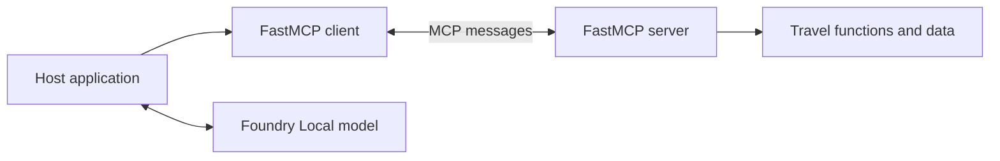

# Understand MCP

**Time: 10 minutes**

The Model Context Protocol is a contract between applications that host models
and servers that expose useful context or actions. It standardizes discovery,
schemas, requests, results, and errors. It does not choose a model or turn a
program into an agent by itself.

## The integration problem

Without a shared protocol, each of $M$ model hosts needs a custom adapter for
each of $N$ systems. That produces roughly $M \times N$ integrations.

With MCP, hosts implement the client side and systems implement the server side.
The shape becomes approximately $M + N$.



In this workshop:

- the CLI or browser application is the **host**
- `fastmcp.Client` owns the MCP **client** connection
- `travel_server.py` is the MCP **server**
- Foundry Local runs the **model**

The model never talks directly to the server. The host discovers tools, gives
their schemas to the model, executes approved requests through the client, and
returns results to the model.

## The three server primitives

| Primitive | Usually selected by | Purpose | Workshop example |
|---|---|---|---|
| Tool | Model | Perform an action or calculation | `get_weather` |
| Resource | Application | Read reference context | `travel://destinations` |
| Prompt | User | Start a reusable workflow | `plan_a_trip` |

The controlling party is the important distinction. A resource is not merely a
read-only tool, and a prompt is not a hidden system instruction.

## Transport and messages

The lab uses **stdio**. FastMCP starts the Python server as a child process and
sends one JSON-RPC message per line through stdin and stdout. There are no ports
or credentials to configure.

Stdout is therefore part of the protocol. A stdio server must send diagnostics
to stderr or a logger, not with an ordinary `print()` call.

FastMCP 4.0.0 speaks MCP revision `2026-07-28`. Requests carry protocol and
client details in `_meta`, and `server/discover` describes server capabilities.
FastMCP handles that envelope for normal client code.

The revision identifies the protocol grammar; discovery identifies what this
particular peer can do. A client must inspect negotiated capabilities before it
uses optional features such as elicitation. Matching version strings alone do
not prove that a server or client implements every optional capability.

## See the wire

Run the raw protocol helper:

```powershell
.\workshop.ps1 raw
```

The helper starts the reference server and sends a `server/discover` JSON-RPC
request without using `fastmcp.Client`. Find these fields in the output:

- `jsonrpc: "2.0"`
- request `id`
- method `server/discover`
- `_meta` protocol version and client information
- the server identity and advertised capabilities in the result

Now compare that with the SDK-driven client:

```powershell
.\workshop.ps1 client
```

The client performs discovery, calls tools, reads a resource, and gets a prompt.
The protocol is the same; FastMCP removes the envelope bookkeeping.

## Checkpoint

You should be able to explain why the model, host, client, and server are four
different roles, and who controls tools, resources, and prompts.

Continue to [Build a FastMCP server](03-build-a-server.md).