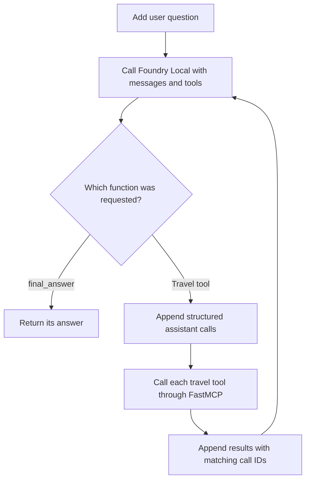

# Run a client and agent loop

**Time: 25 minutes**

An MCP client is useful without a model. An agent appears only when a host adds
a model, gives it tool schemas, executes requested tools, and repeats. This
module makes that boundary visible.

## Part A: call MCP without a model

Run the completed client:

```powershell
.\workshop.ps1 client
```

It starts `src/solution/travel_server.py` over stdio and demonstrates five
ordinary client operations:

1. list tools
2. call `get_weather` for Pune
3. receive a recoverable error for an unknown city
4. read `travel://destinations`
5. get the `plan_a_trip` prompt for Kochi

Open `src/solution/mcp_client.py`. The transport is a trusted local `Path`:

```python
SERVER = REPO_ROOT / "src" / "solution" / "travel_server.py"

async with Client(SERVER) as client:
    tools = await client.list_tools()
    weather = await client.call_tool("get_weather", {"city": "Pune"})
```

FastMCP 4 infers a Python stdio transport from the path. A bare string ending in
`.py` is deprecated because it is ambiguous.

List and read methods return lists directly in FastMCP 4:

```python
resources = await client.list_resources()
contents = await client.read_resource("travel://destinations")
prompts = await client.list_prompts()
```

`call_tool()` raises on a tool error by default. Use
`raise_on_error=False` only when the caller is prepared to inspect the error and
recover:

```python
result = await client.call_tool(
    "get_weather",
    {"city": "Atlantis"},
    raise_on_error=False,
)
```

There is no model, prompt, or API key in this program. MCP is working before any
agent behavior is added.

## Part B: connect the local model

`src/model_config.py` asks the Foundry Local singleton for the
hardware-independent alias `qwen3.5-0.8b`, then explicitly selects its generic CPU
variant so the image does not depend on an optional accelerator. It rejects
unknown, non-tool-capable, or uncached models. If needed, it loads the cached
model and returns its native chat client.

The image builder performed the download earlier. Attendee code only does:

```python
local_model = get_local_model()
llm = local_model.client
```

The Foundry Local chat call is synchronous, while the MCP client is asynchronous.
The agent uses `asyncio.to_thread` so inference does not block the event loop:

```python
response = await asyncio.to_thread(llm.complete_chat, messages, tools)
```

No local HTTP endpoint is required.

Foundry Local SDK 1.2.4 reliably returns structured calls for this model when
`tool_choice` is `required`. The agent therefore supplies the four MCP travel
tools plus one host-only `final_answer` function. The model chooses a travel
tool while it needs data and calls `final_answer` when it is ready to stop. That
last function is handled by the host and is never sent to the MCP server.

## The schema adapter

MCP and model tool calling both use JSON Schema, but their outer objects differ.
The adapter in `src/solution/agent_raw.py` is deliberately small:

```python
def mcp_tools_to_openai(tools) -> list[dict]:
    return [
        {
            "type": "function",
            "function": {
                "name": tool.name,
                "description": tool.description or "",
                "parameters": tool.input_schema,
            },
        }
        for tool in tools
    ]
```

The Python property is `input_schema`; the MCP JSON field on the wire is
`inputSchema`.

## The complete loop



Open the `run()` function and find each arrow in code. Four details prevent
subtle failures:

- keep the assistant turn and its structured tool requests
- omit duplicate raw `<tool_call>` markup when structured calls are present
- attach every tool result to the matching `tool_call_id`
- if a flight answer omits required fields, insert them from the first structured
    flight result instead of starting another slow model turn
- cap the loop with `MAX_TURNS`

The loop also gives malformed JSON and MCP tool errors back to the model as
text. That lets the next turn correct a request instead of crashing the host.

## Run a multi-tool question

```powershell
.\workshop.ps1 agent "Find a flight from Bengaluru to Kochi and tell me what to pack."
```

You should see one or more `-> calling ...` lines followed by a concise answer.
Flight fares are fictional and shown in INR. Exact wording and call order can
vary because the model is generative.

Try a smaller request:

```powershell
.\workshop.ps1 agent "What is the weather in Pune?"
```

Then ask for an unsupported city. Inspect whether the model reads the error,
calls `list_destinations`, or explains the supported set.

## Checkpoint

You can now separate three mechanisms:

- MCP publishes and executes capabilities
- Foundry Local chooses a travel tool or the host-only stopping function
- the host loop preserves conversation state and connects the two

Continue to [Use the browser app](05-browser.md).