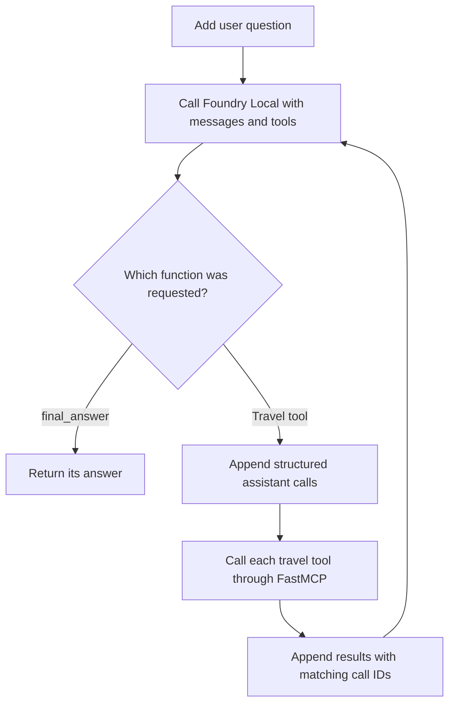

# Run a client and agent loop

**Time: 25 minutes**

An MCP client is useful without a model. An agent appears only when a host adds
a model, gives it tool schemas, executes requested tools, and repeats. This
module makes that boundary visible.

**No code changes are required in this lesson.** Run the supplied programs and
find the excerpts below in the solution files. Do not paste them into your
learner server or run them separately. Each Python block is an exact excerpt;
only its surrounding indentation is removed where needed for readability.
Use the named functions and calls to locate code rather than fixed line numbers.
The supplied programs use the reference server, not your Lesson 3 learner file.

## Part A: call MCP without a model

Run the completed client:

```powershell
.\workshop.ps1 client
```

It starts `src/solution/travel_server.py` over stdio and demonstrates five
ordinary client operations:

1. list tools
2. call `get_weather` for Pune
3. receive a recoverable error for an unknown city
4. read `travel://destinations`
5. get the `plan_a_trip` prompt for Kochi

Open [src/solution/mcp_client.py](../src/solution/mcp_client.py). Find `SERVER`
and the `server_transport()` helper, which returns this trusted local `Path`:

**File:** [src/solution/mcp_client.py](../src/solution/mcp_client.py)  
**Find:** module-level `SERVER` and `server_transport()`.

```python
SERVER = REPO_ROOT / "src" / "solution" / "travel_server.py"


def server_transport() -> Path:
    """Return the trusted local script FastMCP should launch over stdio."""
    return SERVER
```

Find the start of `main()`. It opens the client using that helper:

**File:** [src/solution/mcp_client.py](../src/solution/mcp_client.py)  
**Find in:** `main()` at `Client(server_transport())`.

```python
async def main() -> None:
    async with Client(server_transport()) as client:
        print(f"Connected. Protocol revision: {client.protocol_version}\n")
```

FastMCP 4 infers a Python stdio transport from the path. A bare string ending in
`.py` is deprecated because it is ambiguous.

Inside `main()`, find `list_tools()` and compare the printed names with the
terminal output:

**File:** [src/solution/mcp_client.py](../src/solution/mcp_client.py)  
**Find in:** `main()` at `client.list_tools()`.

```python
tools = await client.list_tools()
print("Tools:")
for tool in tools:
    print(f"  - {tool.name}: {tool.description}")
print()
```

Next, find `list_resources()` and `read_resource()`. List and read methods
return lists directly in FastMCP 4:

**File:** [src/solution/mcp_client.py](../src/solution/mcp_client.py)  
**Find in:** `main()` at `client.list_resources()`.

```python
resources = await client.list_resources()
print("Resources:", [str(resource.uri) for resource in resources])
catalog = await client.read_resource("travel://destinations")
print(catalog[0].text)
print()
```

Find `list_prompts()` immediately below the resource section:

**File:** [src/solution/mcp_client.py](../src/solution/mcp_client.py)  
**Find in:** `main()` at `client.list_prompts()`.

```python
prompts = await client.list_prompts()
print("Prompts:", [prompt.name for prompt in prompts])
prompt = await client.get_prompt(
    "plan_a_trip", {"city": "Kochi", "nights": "4"}
)
print(json.dumps(prompt.messages[0].content.text, indent=2))
```

`call_tool()` raises on a tool error by default. Use
`raise_on_error=False` only when the caller is prepared to inspect the error and
recover. Find the Atlantis call and its `oops` result:

**File:** [src/solution/mcp_client.py](../src/solution/mcp_client.py)  
**Find in:** `main()` at `oops = await client.call_tool(...)`.

```python
oops = await client.call_tool(
    "get_weather", {"city": "Atlantis"}, raise_on_error=False
)
print("get_weather('Atlantis')")
print("  is_error:", oops.is_error)
print("  text    :", oops.content[0].text)
print()
```

Successful typed tools provide `structured_content`. Find the earlier Pune
call, which prints both the structured object and its text representation:

**File:** [src/solution/mcp_client.py](../src/solution/mcp_client.py)  
**Find in:** `main()` at `weather = await client.call_tool(...)`.

```python
weather = await client.call_tool("get_weather", {"city": "Pune"})
print("get_weather('Pune')")
print("  structured:", weather.structured_content)
print("  text      :", weather.content[0].text)
print()
```

Use the structured object for application logic. Text content remains useful
for display, recoverable errors, and compatibility with servers that do not
publish structured output.

There is no model or API key in this program. Retrieving an MCP prompt is not a
model call: MCP is working before any agent behavior is added.

## Part B: connect the local model

`src/model_config.py` asks the Foundry Local singleton for the
hardware-independent alias `qwen3-vl-2b-instruct` and selects its CPU variant
for the VM hardware. It rejects
unknown, non-tool-capable, or uncached models. If needed, it loads the cached
model and returns its native chat client.

The image builder performed the download earlier. Open
[src/solution/agent_raw.py](../src/solution/agent_raw.py) and find the start of
`run()`. It uses an injected client for tests or obtains the cached model's client:

**File:** [src/solution/agent_raw.py](../src/solution/agent_raw.py)  
**Find in:** `run()` at `llm = chat_client`.

```python
llm = chat_client
if llm is None:
    llm = get_local_model().client
llm.settings.tool_choice = {"type": "required"}
```

The Foundry Local chat call is synchronous, while the MCP client is asynchronous.
Inside the turn loop's `try` block, find `asyncio.to_thread`. It keeps inference
from blocking the event loop:

**File:** [src/solution/agent_raw.py](../src/solution/agent_raw.py)  
**Find in:** `run()` at `response = await asyncio.to_thread(...)`.

```python
response = await asyncio.to_thread(
    llm.complete_chat,
    messages,
    tools,
)
```

No local HTTP endpoint is required.

Foundry Local SDK 1.2.4 reliably returns structured calls for this model when
`tool_choice` is `required`. The agent therefore supplies the four MCP travel
tools plus one host-only `final_answer` function. The model chooses a travel
tool while it needs data and calls `final_answer` when it is ready to stop. That
last function is handled by the host and is never sent to the MCP server.

## The schema adapter

MCP and model tool calling both use JSON Schema, but their outer objects differ.
The adapter in `src/solution/agent_raw.py` is deliberately small:

**File:** [src/solution/agent_raw.py](../src/solution/agent_raw.py)  
**Find:** `mcp_tools_to_openai()`.

```python
def mcp_tools_to_openai(tools) -> list[dict]:
    """Translate MCP tool definitions into OpenAI `tools` entries.

    This is the only real 'glue' in the whole loop. Python exposes
    `input_schema`; the JSON field on the wire remains `inputSchema`.
    """
    return [
        {
            "type": "function",
            "function": {
                "name": tool.name,
                "description": tool.description or "",
                "parameters": tool.input_schema,
            },
        }
        for tool in tools
    ]
```

The Python property is `input_schema`; the MCP JSON field on the wire is
`inputSchema`.

## The complete loop



Open the `run()` function and find each arrow in code. These details prevent
subtle failures:

- keep the assistant turn and its structured tool requests
- omit duplicate raw `<tool_call>` markup when structured calls are present
- attach every tool result to the matching `tool_call_id`
- serialize `result.structured_content` for the model instead of parsing JSON
    back out of a text block
- if a flight answer omits required fields, insert them from the first
    structured flight result instead of starting another slow model turn
- cap the loop with `MAX_TURNS`

The loop also gives malformed JSON and MCP tool errors back to the model as
text. That lets the next turn correct a request instead of crashing the host.

## Run a multi-tool question

```powershell
.\workshop.ps1 agent "Find a flight from Bengaluru to Kochi and tell me what to pack."
```

You should see one or more `-> calling ...` lines followed by a concise answer.
Flight fares are fictional and shown in INR. Exact wording and call order can
vary because the model is generative.

Try a smaller request:

```powershell
.\workshop.ps1 agent "What is the weather in Pune?"
```

Then ask for an unsupported city. Inspect whether the model reads the error,
calls `list_destinations`, or explains the supported set.

## Guided code checkpoints

Open `src/solution/agent_raw.py` and find these three boundaries:

1. **Schema check:** identify the one property that moves an MCP input schema
    into the model's function definition.
2. **Result check:** identify where successful structured results and text errors
    take different paths.
3. **Safety check:** find `MAX_TURNS` and the return statement after the loop.
    Predict what would happen if the limit were `2` and the model never stopped.
    Leave the code unchanged at `6`.

Run the deterministic checks after inspecting the loop:

```powershell
.\workshop.ps1 test
```

## Checkpoint

You can now separate three mechanisms:

- MCP publishes and executes capabilities
- Foundry Local chooses a travel tool or the host-only stopping function
- the host loop preserves conversation state and connects the two

Continue to [Use the browser app](05-browser.md).