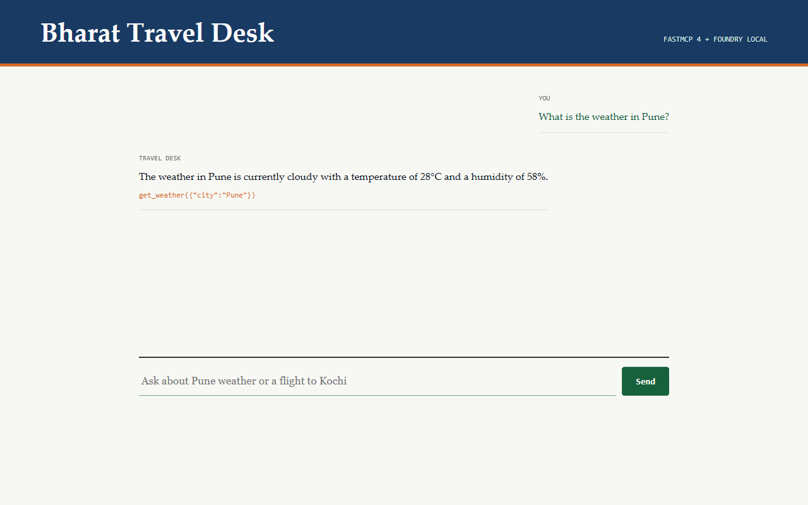

# Use the browser app

**Time: 10 minutes**

The browser is another interface over the same `run()` function. It does not
contain a second agent implementation and it does not connect directly to the
MCP server or model.

## 1. Follow the request path

Open `src/solution/web.py`. The Starlette application has two routes:

```python
app = Starlette(
    routes=[
        Route("/", homepage),
        Route("/api/chat", chat, methods=["POST"]),
    ]
)
```

The API endpoint validates the question, records tool-call events, and delegates
to the existing loop:

```python
tools: list[dict] = []
answer = await run(
    question,
    on_tool_call=lambda name, arguments: tools.append(
        {"name": name, "arguments": arguments}
    ),
)
return JSONResponse({"answer": answer, "tools": tools})
```

The callback changes presentation only. Tool discovery, Foundry Local calls,
MCP execution, result matching, and turn limits remain in `agent_raw.py`.

## 2. Start the local site

```powershell
.\workshop.ps1 web
```

Open <http://127.0.0.1:7932>. Keep the terminal visible for errors and stop the
server with `Ctrl+C` when finished.

## 3. Exercise the agent

Submit this question:

`What is the weather in Pune?`

The orange label shows which MCP tool the model requested. If time remains, try
one slower extension:

- `Find a flight from Bengaluru to Kochi and tell me what to pack.` usually
  needs weather or forecast information plus a flight search.
- `Can you plan a trip to Atlantis?` demonstrates a bounded failure rather than
  invented travel data.

Exact prose can vary, but tool results should remain deterministic for the same
city and date.



*Expected browser state. Exact prose and weather values can vary by workshop
date; look for the orange `get_weather({"city":"Pune"})` trace beneath a grounded
answer.*

## 4. Inspect the HTTP boundary

The browser sends only this local request:

```json
{"question":"What is the weather in Pune?"}
```

The response has an answer and a presentation-friendly tool trace:

```json
{
  "answer": "...",
  "tools": [
    {"name": "get_weather", "arguments": {"city": "Pune"}}
  ]
}
```

The browser never receives model files, server credentials, or permission to
execute arbitrary MCP methods. In a production app, this HTTP boundary is also
where you would authenticate the user, enforce request limits, attach a request
ID, and apply an overall timeout.

## 5. Make one visible change

In `src/solution/web.py`, change the input placeholder to mention another
supported Indian city. Restart `workshop.ps1 web` and confirm the browser shows
your text without changing the agent loop.

## Checkpoint

You have used one agent core from a CLI and a browser and observed the model's
MCP tool choices without exposing internal reasoning.

Continue to [Review production controls](06-where-next.md).