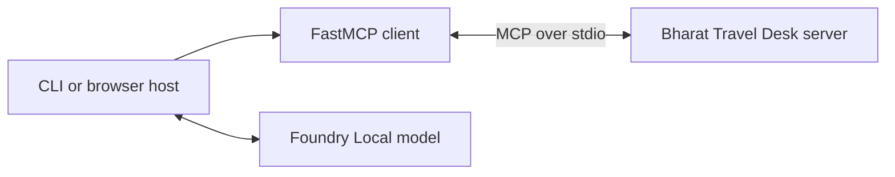

## Replace custom pairs with a protocol

If $M$ model hosts each need custom adapters for $N$ systems, the integration
surface is roughly $M \times N$. MCP gives hosts one client contract and systems
one server contract, making the shape approximately $M + N$.



The host owns both relationships. The model does not open an MCP connection and
the MCP server does not decide which model to use.

## Know the four roles

- **Host:** owns the user experience, model conversation, permissions, and MCP clients
- **Client:** maintains one connection to one MCP server
- **Server:** publishes capabilities and executes requests
- **Model:** can request tools when the host supplies their schemas

## Know who selects each primitive

| Primitive | Selected by | Workshop example |
|---|---|---|
| Tool | Model | `get_weather` |
| Resource | Application | `travel://destinations` |
| Prompt | User | `plan_a_trip` |

The host can always deny a tool request. "Selected by the model" is not the same
as "authorized by the model."

## See the protocol

This course uses stdio, where the host launches a local server and exchanges
JSON-RPC through stdin and stdout. Run:

```powershell
.\workshop.ps1 raw
```

The helper sends `server/discover` with protocol revision `2026-07-28` in
`_meta`. It does not use the FastMCP client. Now run:

```powershell
.\workshop.ps1 client
```

The second command performs useful list, call, read, and prompt operations while
FastMCP handles the same wire envelope.

Because stdout is the stdio protocol channel, server diagnostics belong on
stderr or in a logging sink.